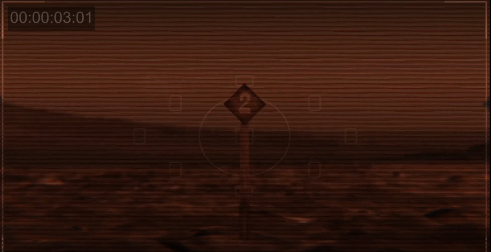

# BRING SJRNR OUT

### Challenge
> Out of this world

The clue takes you to a video taken on the surface of Mars. The Pathfinder's camera is panning between letters and numbers. If you have read the book or seen the movie "The Martian" you might recognize "BRING SJRNR OUT" and the scene where NASA was communicating with Mark by pointing the camera at hexadecimal symbols. Hexadecimal was chosen because it is faster to communicate that way and it only requires 16 symbols instead of the alphabet's 26 which would be awkward to arrange in a circle and still be able to identify which letter the camera was pointing at. Not to mention if he needed to communicate numbers too.

Anyway, once you figure out that there is a hexadecimal message you simply look up the hex values on an ASCII chart to obtain the letter. Put them all together and you have your flag.

|hex|decimal|ascii|
|-----|-----|-----|
|72|114|r|
|65|101|e|
|73|115|s|
|65|101|e|
|74|116|t|
|2D|45|-|
|70|112|p|
|72|114|r|
|65|101|e|
|73|115|s|
|73|115|s|
|2D|45|-|
|64|100|d|
|72|114|r|
|69|105|i|
|65|101|e|
|73|115|s|
