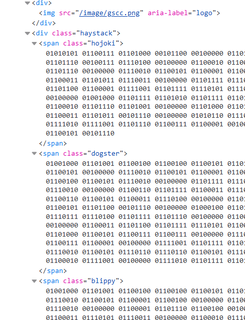

# Needle in an HTML Stack

### Challenge
> link to image

There's no description given with this challenge. Just a link to a page that shows you an animated gif of 1s and 0s. Click on it and you are presented with an image of the GSCC logo... and a background with a whole lot of 1s and 0s. 

The first thing any respectable hacker would do is inpect the page in browser dev tools. With some poking around you'll see something suspicious, what appear to be a whole bunch of bytes:

Of course now you are going to convert those bytes to base 10 and see what the ascii value is. This a tedious process without a script. Cleaning up the data to remove html tags, we can pass all of that text as string through something like this in C#:

    using System.Text;

    string input = @"01010101 01100111 01101000 00101100 00100000 01101000 01101001 01100100 01100100 01100101 01101110 00100000 01100011 01101111 01101110 01110100 01100101 01101110 01110100 00100000 01100011 01100001 01101110 00100111 01110100 00100000 01100010 01100101 00100000 01110010 01100101 01100001 01100100 00100000 01100010 01111001 00100000 01100001 00100000 01110011 01100011 01110010 01100101 01100101 01101110 00100000 01110010 01100101 01100001 01100100 01100101 01110010 00100000 01101111 01110010 00100000 01100100 01100101 01110100 01100101 01100011 01110100 00100000 01100011 01101100 01101001 01100011 01101011 01110011 00100000 01101111 01110010 00100000 01100110 01101111 01100011 01110101 01110011 00101100 00100000 01100001 01100110 01100110 01100101 01100011 01110100 01110011 00100000 01101100 01100001 01111001 01101111 01110101 01110100 00100000 01100001 01101110 01100100 00100000 01100010 01101111 01111000 00100000 01101101 01101111 01100100 01100101 01101100 00111010 00101000 00100000 01001000 01101111 01101010 01101111 01101011 01101001 00100000 01111001 01101111 01101111 01101110 01101111 00100000 01110000 01110010 01100101 01111010 01101001 00100000 01111000 01101111 01100010 01101110 01101001 00100000 01101000 01101111 01101010 01101111 01101011 01101001 00101100 00100000 01110111 01101111 01101111 01110000 01110010 01100001 00100000 01100110 01101100 01100101 01100011 01101011 00101110 00100000 01010110 01110101 01110110 01101111 01111000 00100000 01111000 01101111 01100010 01101110 01101001 00100000 01101001 01101101 01100101 01100101 01101101 00100000 01111010 01111001 01101110 01100111 01100001 00100000 01110111 01101001 01101011 01101001 01100001 00101100 00100000 01101111 01100100 01100101 01101111 00100000 01110011 01101011 01111001 01110000 01100101 00101110 01001000 01101001 01100100 01100100 01100101 01101110 00100000 01100011 01101111 01101110 01110100 01100101 01101110 01110100 00100000 01100011 01100001 01101110 00100111 01110100 00100000 01100010 01100101 00100000 01110010 01100101 01100001 01100100 00100000 01100010 01111001 00100000 01100001 00100000 01110011 01100011 01110010 01100101 01100101 01101110 00100000 01110010 01100101 01100001 01100100 01100101 01110010 00100000 01101111 01110010 00100000 01100100 01100101 01110100 01100101 01100011 01110100 00100000 01100011 01101100 01101001 01100011 01101011 01110011 00100000 01101111 01110010 00100000 01100110 01101111 01100011 01110101 01110011 00100000 01100010 01110101 01110100 00100000 01100100 01101111 01100101 01110011 01101110 00100111 01110100 00100000 01100001 01100110 01100110 01100101 01100011 01110100 00100000 01101100 01100001 01111001 01101111 01110101 01110100 00100000 01101111 01110010 00100000 01100010 01101111 01111000 00100000 01101101 01101111 01100100 01100101 01101100 00101110 00100000 01000100 01101111 01100111 01110011 01110100 01100101 01110010 00100000 01100011 01101000 01110101 01101101 01100010 01111001 00100000 01101011 01101110 01100101 01110111 01110100 01101111 01101110 00100000 01100010 01101111 01111000 01100010 01100101 00100000 01101011 01101100 01101111 01110101 01110100 00100000 01101100 01101111 01101111 01110000 01110100 00100000 01100011 01101100 01101111 01110101 01100100 01100101 01110010 01100001 00100000 01101010 01100001 01101001 01101011 01110101 00100000 01101111 01101111 01101111 01101010 00100000 01100011 01101000 01100101 01100111 01100111 00100000 01110011 01101111 01100011 01101111 01100011 01101111 00100000 01111001 01110101 01101110 01110100 01100001 01100001 00100000 01111010 01100001 01101110 01100111 01100001 00100000 01111001 01101111 01101111 01101110 01101111 00100000 01110011 01110000 01101111 01100011 01101011 00100000 01100110 01101100 01101001 01100011 01101011 01110010 00100000 01110010 01100101 01110110 01110110 01100101 01110010 00100000 01110001 01110101 01101111 01110010 01100001 00100000 01110111 01100001 01111010 01100101 00100000 01100011 01101000 01110101 01101101 01100010 01111001 00100000 01111010 01101111 01101111 01101111 01101101 01110010 00100000 01110011 01110000 01101111 01110100 01101001 01100110 01111001 00101110 01001000 01101001 01100100 01100100 01100101 01101110 00100000 01100011 01101111 01101110 01110100 01100101 01101110 01110100 00100000 01100011 01100001 01101110 00100000 01100010 01100101 00100000 01110010 01100101 01100001 01100100 00100000 01100010 01111001 00100000 01100001 00100000 01110011 01100011 01110010 01100101 01100101 01101110 00100000 01110010 01100101 01100001 01100100 01100101 01110010 00100000 01100001 01101110 01100100 00100000 01100100 01100101 01110100 01100101 01100011 01110100 00100000 01100011 01101100 01101001 01100011 01101011 01110011 00101111 01100110 01101111 01100011 01110101 01110011 00100000 01100010 01110101 01110100 00100000 01100100 01101111 01100101 01110011 01101110 00100111 01110100 00100000 01100001 01100110 01100110 01100101 01100011 01110100 00100000 01101100 01100001 01111001 01101111 01110101 01110100 00100000 01101111 01110010 00100000 01100010 01101111 01111000 00100000 01101101 01101111 01100100 01100101 01101100 00111011 00100000 01101001 01100100 01100101 01100001 01101100 00100001 00100000 01000010 01101100 01101001 01110000 01110000 01111001 00100000 01100011 01101000 01100101 01100111 01100111 00100000 01110010 01101111 01110110 01101001 01101111 00101110 00100000 01001011 01101110 01100101 01110111 01110100 01101111 01101110 00100000 01101011 01101001 01110000 01110000 01110100 00100000 01101111 01110010 01101011 01110101 01110100 00100000 01101000 01100001 01101110 01100100 01100001 01101110 01100111 01101111 00101100 00100000 01100010 01101100 01110101 01100101 00101101 01100100 01101111 01101111 01110010 00101101 01110011 01110000 01101111 01101111 01101110 00100000 01110100 01110111 01101111 01101110 01100101 01110011 00100000 01101000 01110101 01101100 01110101 00101110 001001000 01101001 01100100 01100100 01100101 01101110 00100000 01100011 01101111 01101110 01110100 01100101 01101110 01110100 00100000 01100011 01100001 01101110 00100000 01100010 01100101 00100000 01110010 01100101 01100001 01100100 00100000 01100010 01111001 00100000 01100001 00100000 01110011 01100011 01110010 01100101 01100101 01101110 00100000 01110010 01100101 01100001 01100100 01100101 01110010 00100000 01100001 01101110 01100100 00100000 01100100 01100101 01110100 01100101 01100011 01110100 00100000 01100011 01101100 01101001 01100011 01101011 01110011 00100000 01100001 01101110 01100100 00100000 01100110 01101111 01100011 01110101 01110011 00100000 01100010 01110101 01110100 00100000 01100100 01101111 01100101 01110011 00100000 01100001 01100110 01100110 01100101 01100011 01110100 00100000 01101100 01100001 01111001 01101111 01110101 01110100 00100000 01100001 01101110 01100100 00100000 01100010 01101111 01111000 00100000 01101101 01101111 01100100 01100101 01101100 00101110 00100000 01001110 01100001 01110000 01110011 01110100 01100101 01110010 00100000 01111010 01100001 01110000 01101001 01100101 01110010 00100000 01111010 01100001 01110000 01110000 01101111 01110011 00100000 01101111 01100011 01110100 01101111 01110000 01100001 01110010 01110100 00100000 01110100 01110101 01101101 01100010 01101100 01110010 00101100 00100000 01100100 01101111 01101111 01110011 01110100 01100001 01101110 01100111 00100000 01111010 01100001 01101110 01100111 01100001 00101110 00100000 01001111 01101111 01110110 01101111 01101111 00100000 01101000 01100001 01101110 01100100 01100001 01101110 01100111 01101111 00100000 01100001 01101011 01101001 01110011 01101101 01100101 01110100 00101100 00100000 01101010 01100001 01101010 01100001 01101000 00101110 00100000 01001001 01101101 01110110 01110101 00100000 01100100 01101001 01101001 01100111 01101111 00100000 01100100 01110010 01101111 01110000 01101001 01101111 00100000 01110001 01100101 01111001 01101110 01101111 00101100 00100000 01100010 01101100 01100101 01101011 01101011 01101111 00100000 01100111 01110010 01101111 01100011 01101011 01101001 01110100 00100000 01110111 01101111 01101111 01110000 01110010 01100001 00101110 00100000 01000111 01110011 01101110 01100001 01110000 00100000 01101101 01101111 01100010 01101100 01111001 00100000 01100111 01100101 01101110 01101001 00100000 01100101 01110011 01101011 01101111 01100010 01101111 00100000 01111010 01101100 01101001 01101111 00101100 00100000 01110000 01101100 01101001 01100011 01101011 01100101 01110010 01110011 00100000 01101111 01101111 01101111 01101010 00101110";

    byte[] inputArray = input.Split(' ', StringSplitOptions.RemoveEmptyEntries)
        .Select(b => Convert.ToByte(b,2))
        .ToArray();

    string output = Encoding.ASCII.GetString(inputArray);

    Console.WriteLine(output);

    Inspecting the output, you will notice there is only one spot that looks like a flag because it has words separated by "-". Solved!
    