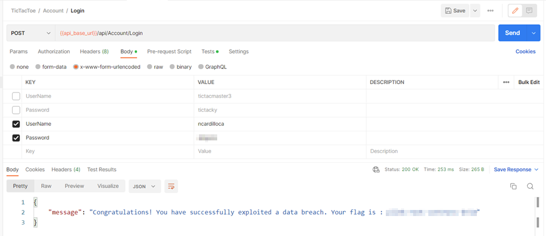

# Repeat Offender

### Challenge
> Sigh... Yet another data breach in the news. I hope none of the leaked accounts use the same credentials to log into the Tic Tac Toe API.

The provided link downloads a csv file that is a dump of the users on a site that has been breached. If you can decrypt the passwords then you can try to see if any Tic Tac Toe users are also users of the breached site and if they used the same password.

One way to go about this would be to put all passwords through an MD5 cracker to see which ones can easily be identified. Why MD5? Because these passords are 16 bytes it most likely is MD5 - which is an older, insecure algorithm. 

But it would be more efficient to first find a user in the file that matches a user in the Tic Tac Toe database. If you already solved [Tic Attack Toe](TicAttackToe.md) then you have already figured out how to enumerate all users in the database. Once you have compiled a list you can compare the users to the users in the breach file. With a little determination you will find user ncardilloca is in both systems. Now you can plug the breached password into any of the online MD5 cracker tools and you will get the plain text password. Now plug that into the Tic Tac Toe login and voila, you have found the flag.

This challenge demonstrates the problem with using the same passwords on multiple sites. If one site it breached then hackers can try the same credentials on a myriad of other sites. Always use unique passwords and always enable multiple factor authentication if it is available.
