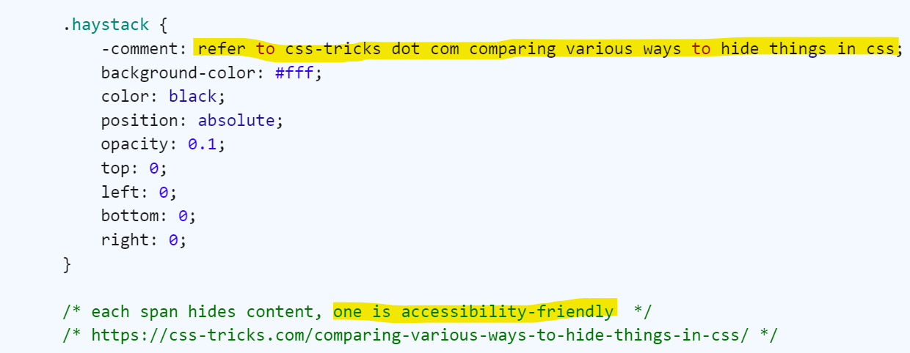
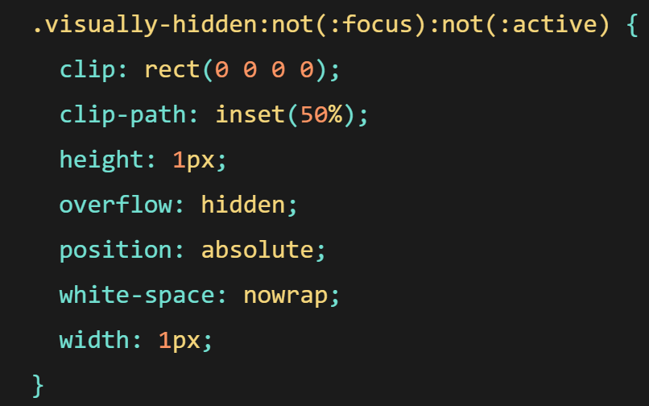
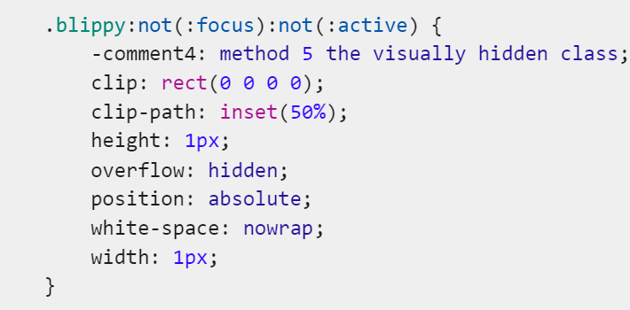
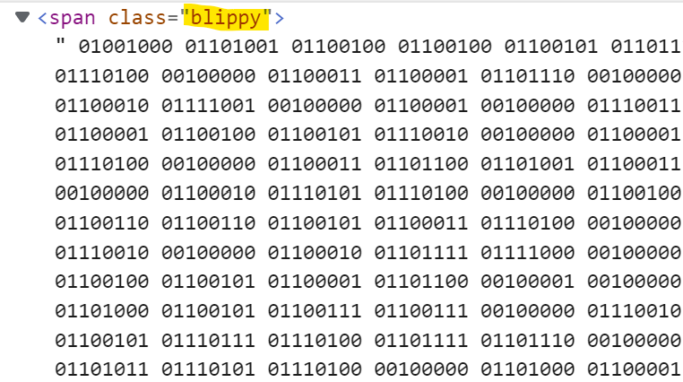
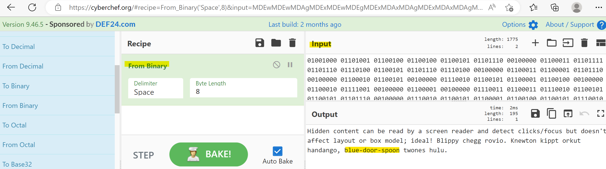

# Needle in an HTML Stack

### Challenge
> link to image

There's no description given with this challenge. Just a link to a page that shows you an animated gif of 1s and 0s. Click on it and you are presented with an image of the GSCC logo... and a background with a whole lot of 1s and 0s. 

  

Used browser dev tools and looked into the <style> and noticed this comment
  
  

Article had a few techniques, one that claimed it was more accessible
  
  

Looked in <style> for a section that looked similar and found "Blippy"
  
  
  
Found that section in Elements panel, looks like just a bunch of binary data
  
  
  
Copied the binary data and went to tool I often use for conversions CyberChef.org.  Pasted binary in the "input" found the "recipe" from binary on left and it showed what looked like a flag in "output"
  
  
  

  
  
