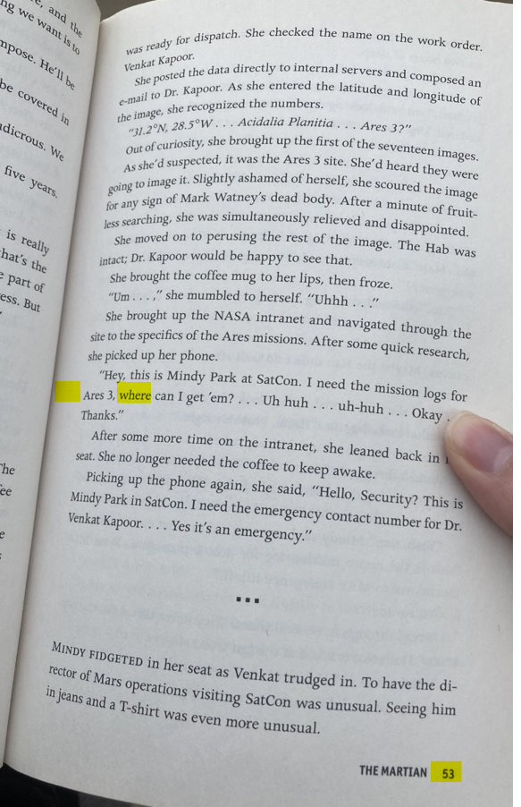

# Physical Challenge

### Challenge
> Must be in-person (or very lucky/intuitive) to get this one. On the day of the event, find the book that contains the solution to: 53.20.3, 
284.6.8, 25.9.6.

Looked like a book cipher, where the 53.20.3 refers to the page.line.word.  Problem was, I was working on this before the day of the code camp 
and I was not going to be physically at the conference.  Had to try to guess what the book was, at first I tried to find the text for the 2 books 
listed in Wikipedia article about the Arnold cipher.  No luck so I looked at what all of the other challenges were about and the one from the movie
"The Martian" looked possible.  Got an ebook version of it but the pages didn't apparently line up.  

My local library did not have the book, but my
daughter drove 20 miles to a library near her and found the book which led to the flag.

The book used in this challenge is the *The Martian* by Andy Weir, ISBN 978-0-553-41802-6. 
