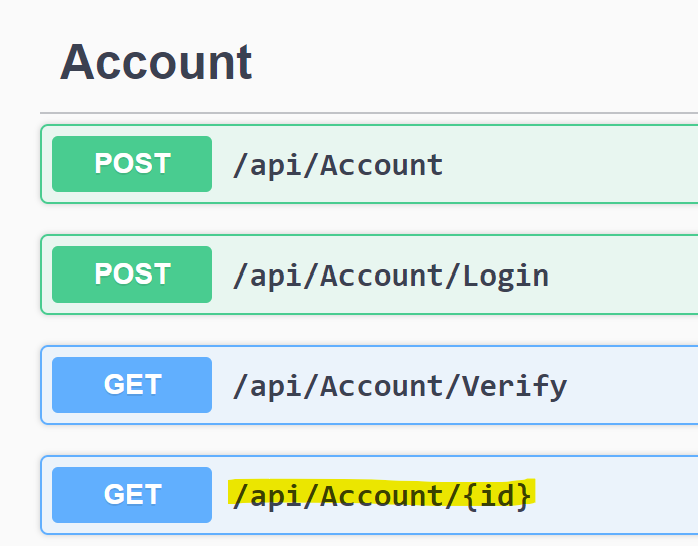
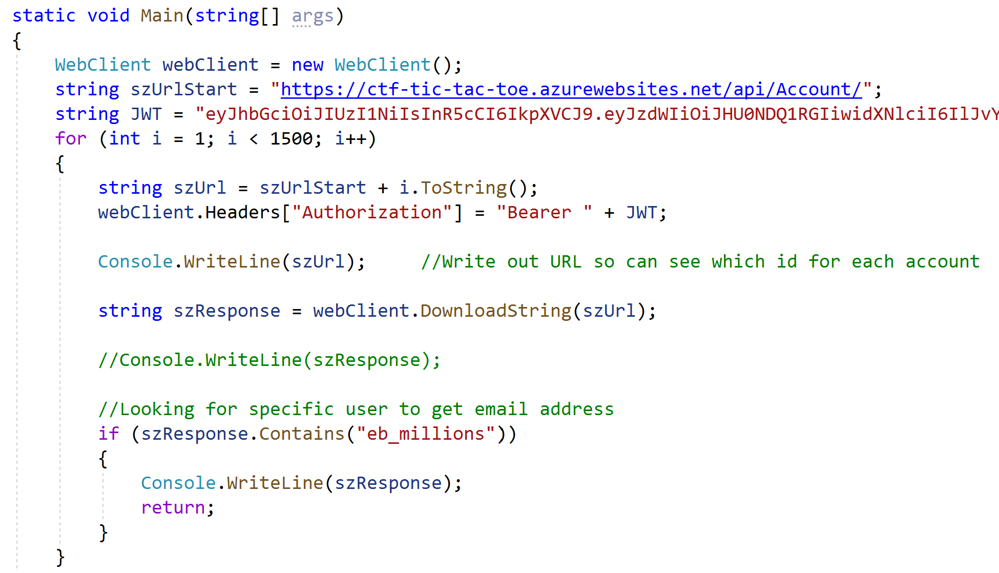
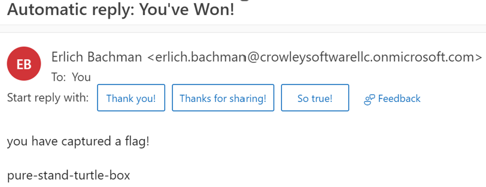

# Tic Attack Toe

### Challenge
> Send a phishing email to eb_millions

Reviewed the provided link with Swagger documentation and found an API that looked like it returned account information provided an id

Already had an account created so just used /api/account/login and provided my userid and password.  Response would contain a JWT token 
needed to access other API methods.  Started just to manually enter some id values starting with 1, hoping to quickly find the account.  
Got tired of that and wrote a .NET program to try sequential id values.

Used email address for eb_millions account to send email, automatic reply contained the flag

