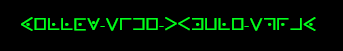
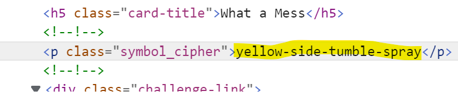

# What a Mess

### Challenge
> 

I recognized it was a pigpen cipher (confirmed by clue with picture of Pigpen from Peanuts).  Tried to manually decipher but wasn't matching up. 
Decided to open browser dev tools and found the flag was right there

