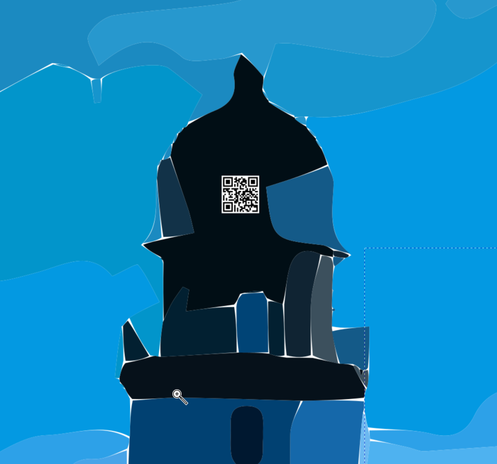

# Security through Obscurity

### Challenge
> Rogues are very keen in their profession, and know already much more than we can teach them.

The clue is a [quote from a Alfred Charles](https://en.wikipedia.org/wiki/Security_through_obscurity) Hobbs who was a locksmith in the mid 19th century. He argued that locks were too easy to pick by anyone with the desire and perseverance because the perceived security only obscured the relatively simple operation of how locks worked.

In this challenge you are given an image of a lighthouse. By all initial appearances, there is nothing particularly interesting:

However, you may notice the image is an SVG (Scalable Vector Graphic) which means you can zoom in on it infinitely. If you do so and you pan around you will eventually discover something interesting:

Scan the QR code and you will have the flag. This challenge is meant to be a reminder that expecting something to be secure because it is hidden is a recipe for disaster. A real-world example would be exposing administrative functions in an app but not putting any links to it anywhere. There are tools that can search for resources that are not linked, and server logs will record the action of these requests.
