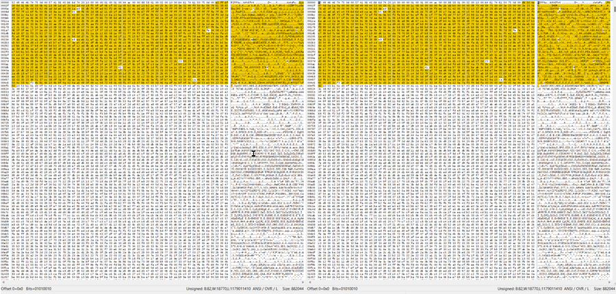

# Sounds Like a Challenge

### Challenge
> Can you see the difference?

The provided link will download a zip file that contains two sound files: before.wav and after.wav. Most likely you cannot hear the difference between the two. The challenge description says "**see** the difference". This is a clue that the difference is visible, not audible.

Lets do a binary compare of the files with a tool called WinMerge:

Scrolling through the output, it looks like the files are identical except for the 1200(ish) bytes that come after the typical .wav header. Another interesting thing is that you can see ".PNG" in the section of differences.

Last year's CTF embedded a sound file in an image, this one is embedding an image in a sound file. If you take all the bytes in after.wav that are different from before.wav and write them to a file with a .png extension you will be able to open it and see the flag.

After analysis of the file differences you will know the difference starts at byte offset 44 and goes to byte offset 1225. With this information you can write a little code to generate the .png file:

C#

    int startIdx = 44;
    int endIdx = 1269;
    
    using (var stream = File.OpenRead("resources\\after.wav"))
    {
        stream.Seek(44, SeekOrigin.Begin);    
        byte[] imageBytes = new byte[1225];
        stream.Read(imageBytes, 0, imageBytes.Length);    
        File.WriteAllBytes(@"c:\deleteme\final.png", imageBytes);    
    }
