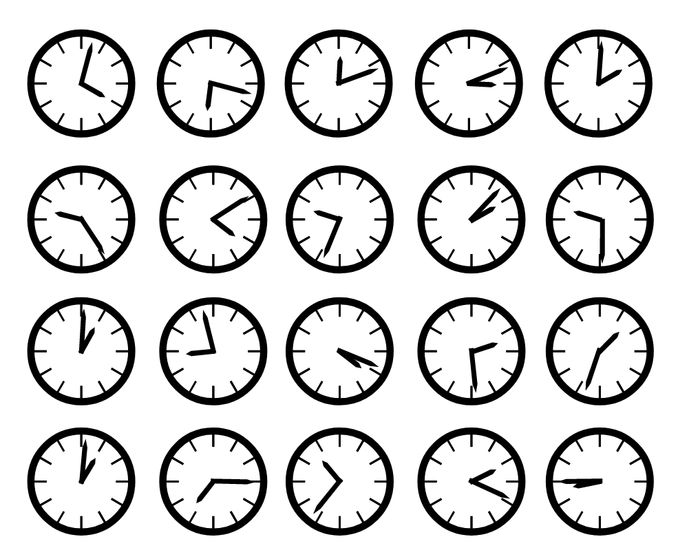

# Take your time

### Challenge
> 1668211200 thru 1668213000 = a 
> 
> 1668213001 thru 1668214800 = b

The provided link gives you an image of a series of clocks:

The clocks should get you thinking about time and that is intended to give you the idea that the numbers might be timestamps.

If you convert these examples from a unix timestamp to a human-readable date/time ([with an online converter perhaps](https://www.epochconverter.com/)), you will arrive at:

1668211200 = Saturday, November 12, 2022 12:00:00 AM

1668213000 = Saturday, November 12, 2022 12:30:00 AM

1668213001 = Saturday, November 12, 2022 12:30:01 AM

1668214800 = Saturday, November 12, 2022 1:00:00 AM

There is a pattern here. If 12:00 thru 12:30 represents "a", and 12:30:01 thru 1:00 represents "b" then we can infer that each half our block represents a letter of the alphabet, sequentially.

Now your job is to convert the clock representations to unix timestamps as of the date of Code Camp (11/12/2022) and then line up the letter of the alphabet with the time.

Here is C# code that can define the 30 minute (ish) ranges:

    DateTimeOffset theDate = new DateTimeOffset(2022, 11, 11, 12, 0, 0, TimeSpan.Zero);
    char[] alpha = new char[] { 'a', 'b', 'c', 'd', 'e', 'f', 'g', 'h', 'i', 'j', 'k', 'l', 'm', 'n', 'o', 'p', 'q', 'r', 's', 't', 'u', 'v', 'w', 'x' };
    for (int i = 0; i < 24; i++)
    {
        var from = theDate.AddSeconds(1);
        var ts = theDate.ToUnixTimeSeconds();
        theDate = theDate.AddMinutes(30);
        Console.WriteLine($"From: {from} TO: {theDate}, ts: {ts}, letter: {alpha[i]}");
    }
 
 Output:

    From: 11/11/2022 12:00:01 PM +00:00 TO: 11/11/2022 12:30:00 PM +00:00, ts: 1668168000, letter: a
    From: 11/11/2022 12:30:01 PM +00:00 TO: 11/11/2022 1:00:00 PM +00:00, ts: 1668169800, letter: b
    From: 11/11/2022 1:00:01 PM +00:00 TO: 11/11/2022 1:30:00 PM +00:00, ts: 1668171600, letter: c
    From: 11/11/2022 1:30:01 PM +00:00 TO: 11/11/2022 2:00:00 PM +00:00, ts: 1668173400, letter: d
    From: 11/11/2022 2:00:01 PM +00:00 TO: 11/11/2022 2:30:00 PM +00:00, ts: 1668175200, letter: e
    From: 11/11/2022 2:30:01 PM +00:00 TO: 11/11/2022 3:00:00 PM +00:00, ts: 1668177000, letter: f
    From: 11/11/2022 3:00:01 PM +00:00 TO: 11/11/2022 3:30:00 PM +00:00, ts: 1668178800, letter: g
    From: 11/11/2022 3:30:01 PM +00:00 TO: 11/11/2022 4:00:00 PM +00:00, ts: 1668180600, letter: h
    From: 11/11/2022 4:00:01 PM +00:00 TO: 11/11/2022 4:30:00 PM +00:00, ts: 1668182400, letter: i
    From: 11/11/2022 4:30:01 PM +00:00 TO: 11/11/2022 5:00:00 PM +00:00, ts: 1668184200, letter: j
    From: 11/11/2022 5:00:01 PM +00:00 TO: 11/11/2022 5:30:00 PM +00:00, ts: 1668186000, letter: k
    From: 11/11/2022 5:30:01 PM +00:00 TO: 11/11/2022 6:00:00 PM +00:00, ts: 1668187800, letter: l
    From: 11/11/2022 6:00:01 PM +00:00 TO: 11/11/2022 6:30:00 PM +00:00, ts: 1668189600, letter: m
    From: 11/11/2022 6:30:01 PM +00:00 TO: 11/11/2022 7:00:00 PM +00:00, ts: 1668191400, letter: n
    From: 11/11/2022 7:00:01 PM +00:00 TO: 11/11/2022 7:30:00 PM +00:00, ts: 1668193200, letter: o
    From: 11/11/2022 7:30:01 PM +00:00 TO: 11/11/2022 8:00:00 PM +00:00, ts: 1668195000, letter: p
    From: 11/11/2022 8:00:01 PM +00:00 TO: 11/11/2022 8:30:00 PM +00:00, ts: 1668196800, letter: q
    From: 11/11/2022 8:30:01 PM +00:00 TO: 11/11/2022 9:00:00 PM +00:00, ts: 1668198600, letter: r
    From: 11/11/2022 9:00:01 PM +00:00 TO: 11/11/2022 9:30:00 PM +00:00, ts: 1668200400, letter: s
    From: 11/11/2022 9:30:01 PM +00:00 TO: 11/11/2022 10:00:00 PM +00:00, ts: 1668202200, letter: t
    From: 11/11/2022 10:00:01 PM +00:00 TO: 11/11/2022 10:30:00 PM +00:00, ts: 1668204000, letter: u
    From: 11/11/2022 10:30:01 PM +00:00 TO: 11/11/2022 11:00:00 PM +00:00, ts: 1668205800, letter: v
    From: 11/11/2022 11:00:01 PM +00:00 TO: 11/11/2022 11:30:00 PM +00:00, ts: 1668207600, letter: w
    From: 11/11/2022 11:30:01 PM +00:00 TO: 11/12/2022 12:00:00 AM +00:00, ts: 1668209400, letter: x

Now, for each clock value, identify which range it falls under to reveal the letter. Then, per CTF convention, put a "-" between the words and you have your flag.