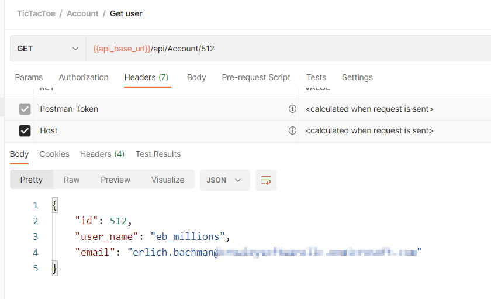

# Tic Attack Toe

### Challenge
> Send a phishing email to eb_millions

The provided link takes you to some documentation for a Tic Tac Toe API. It also has a link to Swagger documentation that describes all of the API operations.

Your challenge is to hack the system to find the email address for the user named "eb_millions". 

Reviewing the Swagger docs you might wonder what the /api/Account/{id} endpoint does. If there is an enumeration vulnerability then you can query this endpoint with seqential numbers until it returns the user information for eb_millions.

Of course you will find that it won't work unless you are logged in, but there are instructions for creating your account in the hint link.

With perseverance or a script to loop over user ids you will eventually land on the entry you are looking for:

The moral of this story is first, always lock down endpoints that should not be exposed to users and second, be careful about using sequential ids. Without proper protection they can be used to discover information.